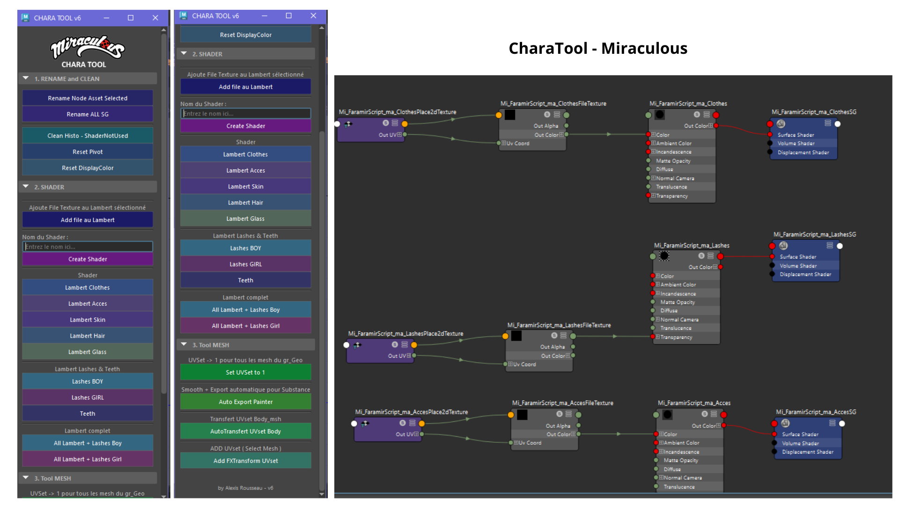

# Miraculous Studio: Character Pipeline Tool (Maya)

**Miraculous Character Tool** est une solution logicielle intégrée pour Autodesk Maya, conçue pour automatiser, standardiser et optimiser le workflow des assets 3D au sein du studio. Ce framework garantit la conformité des données aux exigences du pipeline de la série Miraculous.

---

## Fonctionnalités Clés

### 🏗️ Automatisation du Shading
- **Génération Procédurale** : Création instantanée de shaders Lambert (vêtements, peau, accessoires, etc.) respectant la nomenclature `Mi_[Asset]_[Type]`.

- **Smart Texturing** : Mapping automatique des masques de cils et textures de dents via des chemins relatifs configurables.

- **Custom Shaders** : Bridge pour la création de matériaux personnalisés à la volée.

### 📐 Gestion des UVs & Topologie
- **Standardisation** : Forçage du canal UV 1 et gestion des sets `FXTransform`.

- **Data Transfer** : Algorithme de transfert d'UVs automatisé basé sur un mesh de référence (`body_msh.fbx`).

### 📦 Export & Pipeline
- **Substance Painter Bridge** : Processus automatisé de duplication, application de `polySmooth` et export FBX via `FBXPushSettings`.

- **Asset Cleaning** : Purge sélective de l'historique, des nœuds orphelins (HyperShade) et réinitialisation des transformations (Pivots/Display Colors).

---



## Détails Techniques

### Architecture des Modules

| Module | Description | Action Principale |
| ------ | ------------| ------------------|
| **Rename & Clean** | Sanity check de la scène| `Rename Node, Reset Pivot, History Cleanup`|
| **Shader Engine** | Gestion des matériaux| `Automated Lambert Generation, Texture Mapping `|
| **UV Tools** | Manipulation de données| `UV Set Management, Reference Transfer` |
| **Export System** | Sortie de production | `Painter FBX Export, Automated File Pathing` |


#### Conventions de Nommage (Pipeline)

Le script impose et automatise la nomenclature studio : 
- `Mi_{SceneName}_{Descriptor}_{Type}`

## 📂 Structure du Projet

```bash
Miraculous_Tool3D/
├── asset/              # Ressources binaires (Textures, FBX de référence)
│   ├── T_D_Teeth.1001.png
│   └── body_msh.fbx
├── script/             # Core Logic
│   └── chara_tool.py   # Script principal
└── images/             # Documentation visuelle
```

## ⚙️ Installation & Configuration

### Prérequis
- Autodesk Maya 2022+ (Support Python 3 conseillé, compatible Python 2.7).

- Structure de dossier fixe : C:/Miraculous_Tool3D/ (ou chemin réseau configuré).

### Déploiement
1. Clonez ou copiez le dossier Miraculous_Tool3D sur votre poste.

2. Dans le Script Editor de Maya (onglet Python), exécutez le bootstrap suivant :

```bash
import sys
import os

# Ajout du chemin au sys.path si nécessaire
path = "C:/Miraculous_Tool3D/script"
if path not in sys.path:
    sys.path.append(path)

import chara_tool
reload(chara_tool) # Pour les mises à jour en cours de session
chara_tool.create_ui()
```

### Configuration des Variables d'Environnement

Les chemins globaux peuvent être édités directement dans le header du fichier `chara_tool.py` sous la section `SET PATH`.

## 📖 Cas d'Utilisation

### 1. Initialisation d'un Asset
Utilisez le bouton `All Lambert + Lashes` pour générer l'intégralité du stack de matériaux conforme. Le script vérifie la présence du groupe parent `GEO` avant exécution.

### 2. Export vers le Texturing
La fonction `Auto Export Painter` prépare un mesh "high-poly" temporaire pour garantir un baking de qualité sans altérer la scène de travail originale.

## ⚠️ Limitations & Notes Techniques

- **Hiérarchie** : L'asset doit impérativement être structuré sous un groupe racine nommé `GEO`.

- **Performance** : Le nettoyage de l'HyperShade peut prendre quelques secondes sur des scènes lourdes contenant de nombreux shaders non assignés.

## 👤 Auteur & Maintenance

- **Développeur** : Alexis Rousseau (Python Pipeline Developer)

- **Version** : 6.0.0

- **Dernière mise à jour** : 23 Mai 2025

- **Licence** : Usage interne exclusif - Studio Miraculous.

--- 
*Optimisé pour le workflow de production 3D.*