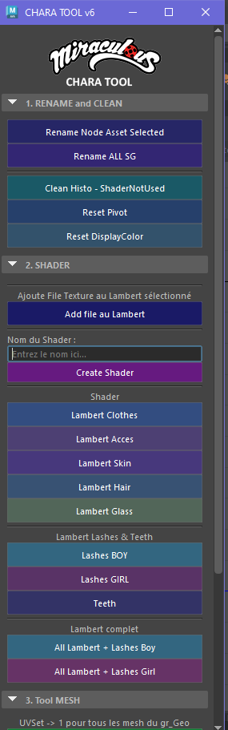
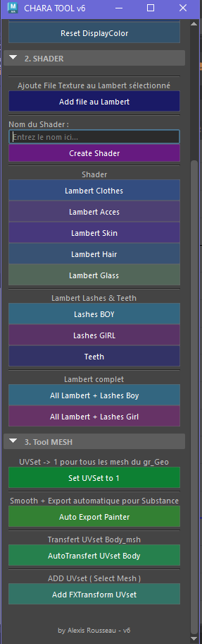
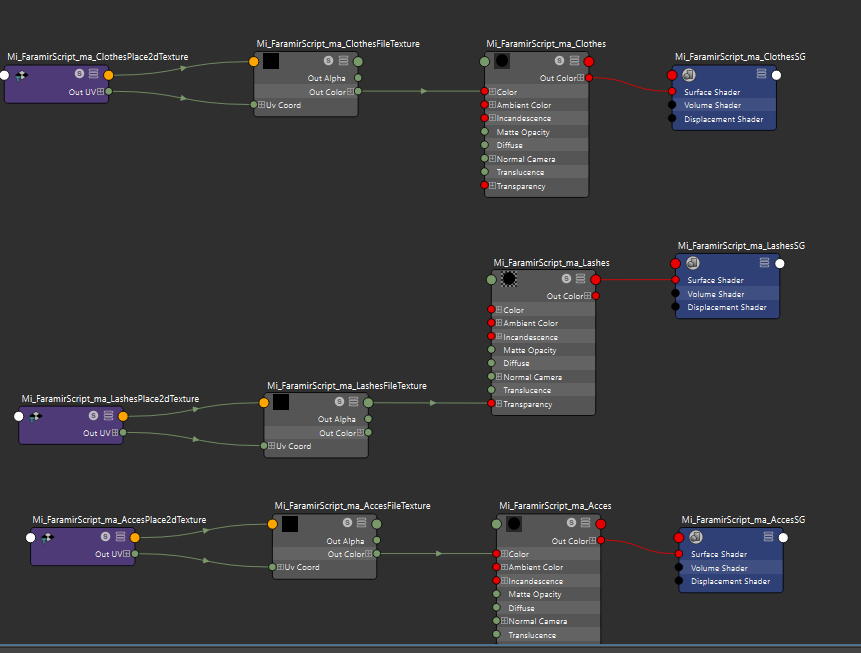

# Miraculous Studio Character Tool for Maya
**Interface tout-en-un pour le pipeline 3D du studio Miraculous**
- *Développé par Alexis Rousseau – Technical Artist IT*
- *Version : 6 – Dernière mise à jour : 23/05/2025*

---

## **Présentation**
- Ce script Python pour **Autodesk Maya** est une interface centralisée conçue pour **accélérer et standardiser** le workflow de création de personnages 3D pour la série *Miraculous*. Il regroupe des outils de **renommage, gestion des shaders, UVs, export FBX et nettoyage de scène**, spécialement adaptés aux besoins du studio.

**Fonctionnalités clés** :
- Création automatique de **shaders Lambert** (vêtements, peau, accessoires, cheveux, cils, dents, verre).
- Gestion des **UVs** (réinitialisation, transfert, ajout de sets FXTransform).
- **Export automatisé** pour Substance Painter.
- Nettoyage de scène et réinitialisation des pivots/display colors.
- Interface intuitive avec **boutons colorés** et sections organisées.

---

## 🛠 **Fonctionnalités détaillées**

### **1. Rename & Clean**
| Fonction | Description | Capture d’écran |
|----------|-------------|-----------------|
| **Rename Node Asset Selected** | Renomme le nœud sélectionné selon la convention `Mi_[NomScène]`. | 
| **Rename ALL SG** | Renomme tous les *Shading Engines* pour correspondre à leurs shaders Lambert. | 
| **Clean Histo - ShaderNotUsed** | Supprime l’historique de construction et les nœuds inutilisés dans le *HyperShade*. | 
| **Reset Pivot** | Réinitialise les pivots des meshes du groupe `GEO` à l’origine (0,0,0). |
| **Reset DisplayColor** | Désactive les *display colors* sur tous les meshes du groupe `GEO`. | 

---

### **2. Shaders**
#### **Création de shaders Lambert**
- **Lambert Clothes/Acces/Skin/Hair/Glass** : Crée des shaders Lambert prédéfinis avec des noms standardisés (`Mi_[NomScène]_[Type]`).
- **Lambert Lashes (Boy/Girl)** : Applique une texture de cils masquée (fichiers `T_O_Lashes_Masked_Boy/Girl.1001.png`).
- **Lambert Teeth** : Applique une texture de dents (`T_D_Teeth.1001.png`).
- **All Lambert + Lashes (Boy/Girl)** : Crée tous les shaders d’un coup pour un personnage masculin ou féminin.
- **Add File au Lambert** : Ajoute un nœud *File* à un shader Lambert sélectionné.
- **Create Shader Perso** : Permet de créer un shader personnalisé via un champ de texte.

#### **Textures par défaut**
| Type | Chemin | Aperçu |
|------|--------|--------|
| Cils (Garçon) | `Miraculous_Tool3D/asset/T_O_Lashes_Masked_Boy.1001.png` | 
| Cils (Fille) | `Miraculous_Tool3D/asset/T_O_Lashes_Masked_Girl.1001.png` |
| Dents | `Miraculous_Tool3D/asset/T_D_Teeth.1001.png` | 

---

### **3. Outils Mesh & UVs**
| Fonction | Description | Capture d’écran |
|----------|-------------|-----------------|
| **Set UVSet to 1** | Force le premier UV set sur tous les meshes du groupe `GEO`. | 
| **Auto Export Painter** | Duplique `GEO`, applique un *polySmooth*, et exporte en FBX dans un dossier `Exports`. | 
| **AutoTransfert UVset Body** | Transfère les UVs depuis un FBX de référence (`body_msh.fbx`) vers le mesh `body__msh`. | 
| **Add FXTransform UVset** | Ajoute un UV set `FXTransform` (copie du set par défaut) aux meshes sélectionnés. | 

---

### **4. Workflow optimisé**
- **Conventions de nommage** : Tous les shaders et nœuds suivent la nomenclature `Mi_[NomScène]_[Type]` pour une intégration fluide dans le pipeline.
- **Paths configurables** : Les chemins des textures et du FBX de référence sont définis en tête de script.
- **FBX Push Settings** : Utilise `mel.eval('FBXPushSettings;')` pour garantir des exports compatibles avec Substance Painter.

---

## 📂 **Structure du projet**
```
Miraculous_Tool3D/
├── asset/
│   ├── T_D_Teeth.1001.png
│   ├── T_O_Lashes_Masked_Boy.1001.png
│   ├── T_O_Lashes_Masked_Girl.1001.png
│   ├── miraculous_logo.png
│   └── body_msh.fbx
└── script/
└── chara_tool.py  # Ce script
```

---

## **Installation & Utilisation**
### **Prérequis**
- **Autodesk Maya** (testé sur Maya 2022/2023).
- **Python 2.7** (intégré à Maya).
- **Dossier `Miraculous_Tool3D`** placé dans un chemin accessible (ex: `C:/Miraculous_Tool3D/`).

### **Étapes**
1. Copier le dossier `Miraculous_Tool3D` dans un emplacement accessible.
2. Ouvrir Maya et exécuter le script via le *Script Editor* :
   ```python
   import chara_tool
   chara_tool.create_ui()
3. L’interface apparaîtra sous le nom "**CHARA TOOL v6**".

### **Configuration**
Modifier les chemins dans la section SET Path si nécessaire :
- Copierimage_path_teeth = "Miraculous_Tool3D/asset/T_D_Teeth.1001.png"
- auto_transfert_path = "Miraculous_Tool3D/asset/body_msh.fbx"


---
## Cas d’usage

**1. Préparation d’un personnage**
- Utiliser All Lambert + Lashes (Boy/Girl) pour créer tous les shaders.
- Appliquer AutoTransfert UVset Body pour standardiser les UVs.
- Exporter avec Auto Export Painter pour Substance Painter.

**2. Nettoyage de scène :**
- Exécuter Clean Histo - ShaderNotUsed avant de sauvegarder.

**3. orrection des UVs :**
- Utiliser Set UVSet to 1 ou Add FXTransform UVset selon les besoins.


---
## Limitations & Notes

**- Groupe GEO obligatoire :** Le script suppose que tous les meshes sont sous un groupe nommé GEO.
**- Compatibilité :** Développé pour le pipeline **Miraculous**. Certaines fonctions (ex: transfert UV) dépendent de la structure spécifique des assets du studio.

## Captures d’écran
**- Interface :**

 


**- Exemple de shader shader automatique :**



---
# 📜 Licence & Crédits

**Développeur** 
- Alexis Rousseau – Technical Artist IT @ Studio Miraculous.

**Licence** 
- Interne au studio 

**Remerciements** 
- À l’équipe 3D du studio pour les retours et tests.

